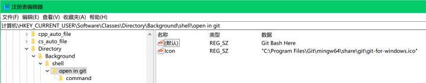
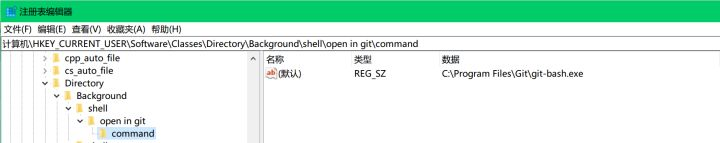

# 步骤：
- 通过在“运行”中输入‘regedit’，打开注册表。
- 找到[HKEY_CLASSES_ROOT\Directory\Background]。
- 在[Background]下如果没有[shell],则右键-新建项[shell]。
- 在[shell]下右键-新建项[open in git],其值为“Git Bash Here",此为右键菜单显示名称。在[shell]下右键-新建-字符串值[Icon],双击编辑，其值为"C:\ProgramFiles\Git\mingw64\share\git\git-for-windows.ico"。此为菜单加图标。（这个icon的位置需要自己重新定向）
- 在[open in git]下右键-新建-项[command],其值为C:\ProgramFiles\Git\git-bash.exe 。

